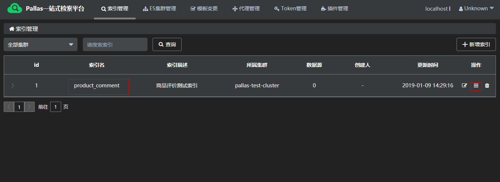
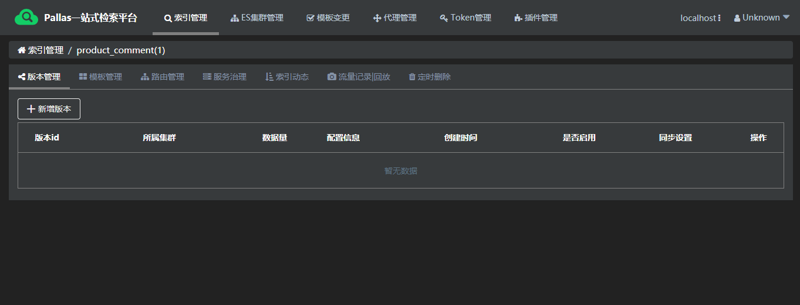
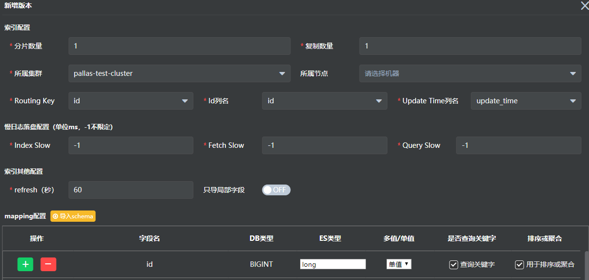
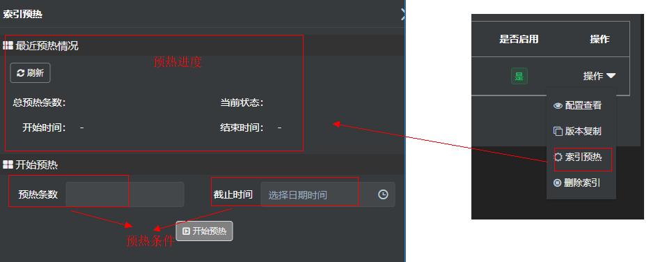
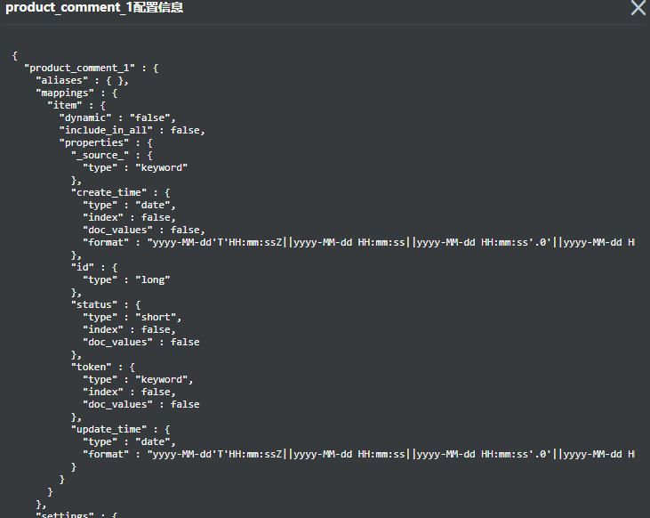
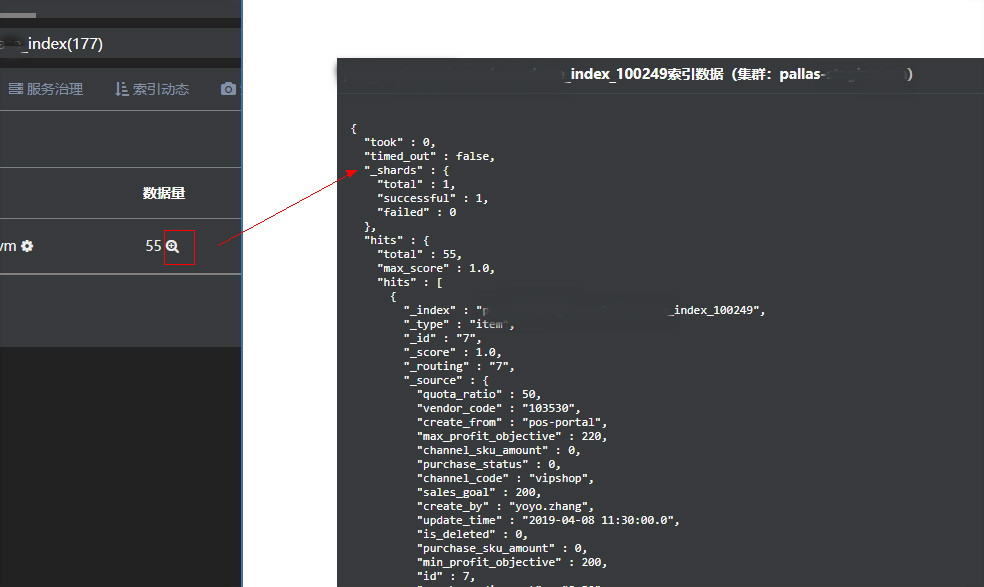

## 概述

业务人员在开发时，对于同一索引，可能会修改数据源、集群，或者设置不同的Mapping信息进行不同的测试。为了避免业务人员由于以上情况重复创建索引的麻烦，Pallas Console提供同一索引的不同版本管理。

## 1 版本总览

可通过点击索引名或者操作栏下的管理按钮进入版本管理页面：

## 2 新增版本

  - mysql

    

    
    
    当数据源为mysql时，如上图所示，具体解释如下：
      
      - 分片数量：索引的分片数量
    
      - 复制数据：索引的复制数量
  
      - Routing Key：分片字段
  
      - ID列： 唯一键字段
  
      - Update Time列：更新时间字段
  
      - 只导局部字段：返回结果里是否只包含mapping配置的字段
  
      - 索引落盘日志
        
        Index Slow: 索引写入慢日志阀值
        
        Fetch Slow: 索引fetch慢日志阀值
        
        Query Slow: 索引query慢日志阀值
        
      - 索引其他配置:
      
        refresh(秒): 索引刷新时间间隔
      
      - mapping配置
        
        > 注意：text有两种类型，text（标准分词）和text（逐字分词）。区别为：标准分词->中文逐字，英文整个；逐字分词->中文或英文都是逐字，业务根据具体情况选择。

        > 注意：多值/单值，多值是指数组的意思 
        
        > 注意：查询关键字，对应sql语句中的过滤条件
        
        > 注意：排序或聚合，对应sql语句中用于排序、聚合的字段

  
## 3 创建索引

点击创建索引按钮，在Elastic search集群中创建相应索引。

## 4 启用版本

点击启用版本按钮，使当前版本的索引生效。

> 当前如果有其他版本处于启用中，此操作会将之前启用的版本停掉。

## 5 同步（此功能暂未开源）

将数据同步到Elastic search集群中。

## 6 索引预热

> 索引在被真实使用前，通过非直接流量的请求打压，构造真实调用环境，使得索引状态达到最佳。

使用场景：

 - 因各种原因（如字段结构调整等）需重建版本
 
 - 对延时敏感：新版本索引没cache，导致一堆timeout
 
 - 索引充分预热之后，再切新版本，降低业务方timeout的概率

> 预热条件必须指定；如果时间与条数都指定了，当满足其一时，即视为预热结束
    
> 详细设计见 Pallas search

## 7 其他操作

### 7.1 查看配置信息

查询此版本索引在es中的mapping信息。

### 7.2 数据量

快速查看同步到ES的数据是不是符合用户期望。

### 7.3. 版本复制

快速拷贝已存在的版本。

### 7.4 删除操作

  - 删除索引

  - 删除版本