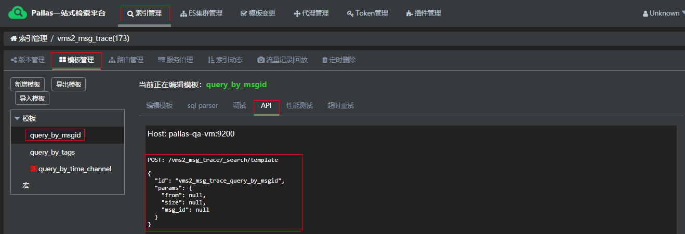

## 概述

Pallas rest客户端对Elasticsearch-rest进行了封装了，并且做了如下工作：

- 优化http连接属性默认值：最大连接数、maxPerRoute、timeout时间等

- 增加一些header：Content-type/token/es/host(without 80 port)/lz4/templateId

- 集成监控埋点

- 自动路由发现并连接至具体的Pallas search，具体调用链为client -> pallas search -> es


## 一 设计


上图简要描述了Pallas客户端的实现原理：

1. 开发人员使用客户端时，需传入Token。Token控制开发人员的访问权限，详见Pallas Console中的Token设计。

2. 客户端`定时`从Pallas Console获取Pallas Search或者ES Cluster的地址。如果Token是启用中的状态，获取的是Pallas Search（详见Pallas Search设计）的地址；如果Token处于禁用中，获取的是ES cluster地址。

3. 当Token授权的集群发生变化时，客户端内部会重新构建PallasRestClient，同时后台线程会将之前创建的PallasRestClient销毁，此过程对开发人员透明。

## 二 准备工作 

### 2.1 环境要求
   
  - Java版本 >= 1.8
  
### 2.2 设置 Pallas-Rest-Client 访问不同环境的Console

客户端默认会起线程访问 localhost:8080（Pallas Console的地址），根据token拿到Pallas search地址进行连接。所以不同环境要配置不同host，

```java
通过增加env -DVIP_PALLAS_CONSOLE_QUERY_URL=http://my-pallas-console.com/pallas/ss/query_pslist_and_domain.json
或者本地代码在是用PallasRestClient前面增加静态代码片段
{
    System.setProperty("VIP_PALLAS_CONSOLE_QUERY_URL",
    			"http://my-pallas-console.com/pallas/ss/query_pslist_and_domain.json");
}

```  

## 三 Maven Dependence

````
<dependency>
  <groupId>com.vip.pallas</groupId>
  <artifactId>pallas-rest-client</artifactId>
   <!-- 修改成指定版本 -->
  <version>master-SNAPSHOT</version>
</dependency>

````

## 四 客户端用法

### 4.1 申请Token  

  由于使用了token鉴权授权，业务开发需要告诉Pallas对接人要用到哪些索引，Pallas对接人会针对这些索引开同对应的权限。

  > 当前,不同的环境配置不同的token,业务开发切记配置正确token
   
### 4.2 初始化PallasRestClient

  - 方式一(推荐)
  
    >使用默认HttpClient
  
    ```java
    PallasRestClient restClient = PallasRestClientBuilder.buildClient(token, maxTimeoutMils);
      
    ```
    参数解释:
  
     - token: 鉴权token,不同环境设置不同的token
     - maxTimeoutMils : ES原生RestCient中的参数，最大重试超时时间
  
  - 方式二
  
    >   使用自定义的HttpClient
    
    ````java
     RequestConfig.Builder requestConfigBuilder = RequestConfig.custom()
             .setConnectTimeout(int connectTimeout).setSocketTimeout(int socketTimeout)
             .setConnectionRequestTimeout(int connectionRequestTimeout);
             
     CloseableHttpAsyncClient httpClientBuilder = HttpAsyncClientBuilder
             .create().setDefaultRequestConfig(requestConfigBuilder.build())
             .setMaxConnPerRoute(int maxConnPerRoute).setMaxConnTotal(int maxConnTotal).build();
     
     PallasRestClient customConfigRestClient = PallasRestClientBuilder.buildClient(token, httpClientBuilder, maxTimeoutMils);
    ````
     
     参数解释:
     
       - connectTimeout: 链接建立的超时时间
       
       - socketTimeout: 套接字超时
       
       - connectionRequestTimeout: http clilent中从connetcion pool中获得一个connection连接的超时时间
       
       - maxConnPerRoute: 同一个route最大的并发连接数
       
       - maxConnTotal: 最大并发连接数
       
       - maxTimeoutMils : ES原生RestCient中的参数，最大重试超时时间
         
         > 这几个超时参数的区别: maxTimeoutMils为总超时，即是只要这个时间到了，就一定超时了。因此业务只需要关心maxTimeoutMills即可。
    
    > 使用推荐: 请把该代码放在jvm容器启动后执行的地方并缓存起来。（初始化一次，持续用）
    
### 4.3 通过template查询
  
适用场景：基本的业务查询
  
  - Pallas console查询API
  
    
  
  - 执行请求
    
    ````java
      HttpEntity entity = new NStringEntity("{\"id\":\"vms2_msg_trace_query_by_msgid\"}", ContentType.APPLICATION_JSON);
      
      String method = "POST";
            
      String endPoint = "/vms2_msg_trace/_search/template";
      
      String templateId = "vms2_msg_trace_query_by_msgid";
     
      Response response = restClient.performRequestWithEmptyParamsAndNoHeaders(method, endPoint, templateId, entity);
      
      //或者
      Response response = restClient.performRequest(method, endPoint ,Collections.<String, String>emptyMap(), templateId, entity, new Header[0]);
    ````

 - 解析返回值
  
    以Json格式返回结果
 
   ````java
   HttpEntity httpEntity = response.getEntity();
  
   String jsonString = EntityUtils.toString(httpEntity);
  
   //将json字符串转为所需Object
   JSON.parseXXX(jsonString, XXX);
     
   ````    
   
### 4.4 通过scoll深度分页
适用场景：大批量的文档查询（比如超过**10000**的文档获取）

  - 基于template查询，初始化scroll，获取scroll_id

	```java

	String json = "{\"params\": {}}";
	HttpEntity entity = new NStringEntity(json, ContentType.APPLICATION_JSON);
	String method = "POST";
	String endPoint = "/chatinfo/template/_search?scroll=1m";
	String templateId = "chatinfo_vip_vchat_search";
	Response response = restEsClient.performRequest(method, endPoint, Collections.emptyMap(), templateId, entity, null);
	String result = EntityUtils.toString(response.getEntity(), "UTF-8");
	
	```

  - 通过基于scroll查询，通过scroll_id，获取后续的查询数据

	> 重复多次执行当前过程，直至返回结果中hits为空对象，或者业务数据了已满足要求。

	```java

	String json = "{ \"scroll\": \"1m\", \"scroll_id\": \"DXF1ZXJ5QW5kRmV0Y2gBAAAAAAABo_oWYXFZZmRTb3BTLWlTdzhhcWJfMl9Fdw==[189]\"}";
	HttpEntity entity = new NStringEntity(json, ContentType.APPLICATION_JSON);
	String method = "POST";
	String endPoint = "/_search/scroll";
	Response response = restEsClient.performRequest(method, endPoint, Collections.emptyMap(), null, entity, null);
	String result = EntityUtils.toString(response.getEntity(), "UTF-8");

	```

  - 获取完数据后，删除scroll_id

	```java

	String json = "{\"scroll_id\": \"DXF1ZXJ5QW5kRmV0Y2gBAAAAAAABo_oWYXFZZmRTb3BTLWlTdzhhcWJfMl9Fdw==[189]\"}";
	HttpEntity entity = new NStringEntity(json, ContentType.APPLICATION_JSON);
	String method = "DELETE";
	String endPoint = "/_search/scroll";
	Response response = restEsClient.performRequest(method, endPoint, Collections.emptyMap(), null, entity, null);
	String result = EntityUtils.toString(response.getEntity(), "UTF-8");

	```

### 4.5 通过_bulk批量索引
适用场景：文档的批量变更，建议一次批量文档数不要超过**800**个
  
  - 构建请求体
	
   > 使用XContentBuilder构建
   
   ````java
    XContentBuilder builder = XContentFactory.contentBuilder(XContentType.JSON);

    builder.startObject().startObject("index")
    	.field("_index", "chatinfo")
    	.field("_type", "detail")
    	.field("_id", "1164170849")
    	.field("_parent", "8498").endObject().endObject();
		
    builder.rawValue(new BytesArray("\n"), XContentType.JSON);
	
    builder.startObject().field("id", "1164170849")
    	.field("chatid", "8498")
	    .field("senderName", "在线客服")
	    .field("receiverName", "访客#8508")
	    .field("msg", "阳光暖暖的，在最好的季节遇见最好的您，小唯很乐意为您效劳，请问有什么可以帮到您吗？")
	    .field("sendtime", "2019-01-17 11:47:29.0")
	    .field("flag", "2")
	    .endObject();
		
    builder.rawValue(new BytesArray("\n"), XContentType.JSON);

    String json = builder.bytes().utf8ToString();
	
   ````
   
   > 用Jons字符拼接
   
   ````java
   String json = "{\"index\":{\"_index\":\"chatinfo\",\"_type\":\"detail\",\"_id\":\"1164170849\",\"_parent\":\"8498\"}}\n" + 
				  "{\"id\":\"1164170849\",\"chatid\":\"8498\",\"senderName\":\"在线客服\",\"receiverName\":\"访客#8508\",\"msg\":\"阳光暖暖的，在最好的季节遇见最好的您，小唯很乐意为您效劳，请问有什么可以帮到您吗？\",\"sendtime\":\"2019-01-17 11:47:29.0\",\"flag\":\"2\"}\n";
				  
   ````
   > 因为_buk 格式的原因，大家一定要小心"\n"的录入
   
  - 执行请求
	
	````java
	 HttpEntity entity = new NStringEntity("{\"id\":\"vms2_msg_trace_query_by_msgid\"}", ContentType.APPLICATION_JSON);
	  
      String method = "POST";
      String endPoint = "/chatinfo/_bulk";
      String templateId = null;
      
      Response response = restClient.performRequest(method, endPoint ,Collections.<String, String>emptyMap(), templateId, entity, new Header[0]);
	  
	````
	


