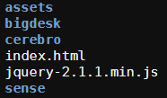

# Pallas部署指引

Pallas需要部署的模块主要包括：
  
  - pallas-console
  
  - pallas-console-web
  
  - pallas-search
  
  - pallas-index （数据同步模块，尚未开源，可以先跳过）
  
## Pallas Console

  - 部署前准备

    - 硬件要求
     
      Linux服务器至少一台
  
    - 软件要求
  
      1. jdk: 1.8+
      
      2. mysql: 版本无要求
    
  - 打包（pallas-console提供两种打包方式）

    - `mvn clean package -Dspringboot.package=1`（集成了前端pallas-console-web和第三方插件pallas-plus-web的前后端集成包，支持一键部署console前后端）
    
    - `mvn clean package` (单独打包console后端)
  
  - 部署
  
    - 打包后会生成目标文件pallas-console-zip.zip（见target/pallas-console-zip.zip）
      
    - 拷贝pallas-console-zip.zip包到服务器
    
    - 解压zip包可见：
          
      1. bin文件夹（包含一个pallas-console.sh脚本，脚本包含一系列服务端调优的启动设置）
      
      2. lib文件夹（console运行依赖的库）
      
      3. pallas-console.jar包
      
    - 运行：
    
      1. 通过 pallas-console.sh 启动：`sh ./bin/pallas-console.sh [运行参数]`  如：使用h2运行的前后端集成包： sh pallas-console.sh -Dpallas.db.type=h2 -Dspring.profiles.active=combo
      
      2. 通过 pallas-console.jar 启动： `java [运行参数] -jar pallas-console.jar` 如：使用mysql运行的单独console包： java -Dpallas.db.type=mysql -jar pallas-console.jar 
     
    - 运行参数：
    
      |参数|含义|
      |---|---------|
      |-Dpallas.db.type|指定运行使用的数据库类型，目前支持两种：mysql和h2|
      |-Dspring.profiles.active=combo|如果打包方式为前后端集成包，则需要指定combo profile|
  
  - 注意点
  
    - 单独打包的方式，console默认加上pallas前缀的context-path（见src/resources/application.properties），意味着访问接口时需要如：http://xxx.com/pallas/xxx/xxx.json 的方式。console前端接口默认也会带上pallas前缀，如果需要去掉，前后端都得去掉
    
    - 集成了前端GUI的打包方式，默认去掉了pallas前缀，但必须部署在host指向的目录下
    
    
## Pallas Console Web

  - 打包

    1. 执行指令： `yarn build`
    
    2. 生成目标文件： pallas-console-web根目录->dist文件夹
  
  - 部署

    1. 新建文件夹front
  
    2. 拷贝目标文件（dist文件夹下的所有文件）到front（如果前后端部署在不同服务器，可通过修改src/utils/request.js的axios.defaults.baseURL 指定前端接口请求地址）
    
    3. 拷贝pallas-plus-web下的所有文件到front
  
  - 注意点

    1. src/utils/request.js的axios.defaults.baseURL默认加了`./pallas/`前缀，如果前后端部署在不同机器或者console把pallas前缀去掉了，可以通过修改baseURI指定
    
    2. pallas-console-web项目必须放在host指向的目录下
    
    3. 前端目录最终结构图如下：
    
       

## 1 Pallas Search

  - 打包： `mvn clean package`
  
    - 目标文件： pallas-search 根目录 -> target -> pallas-search-master-SNAPSHOT-zip.zip
    
    - 解压目标文件，会得到： bin文件夹（包含一个启动脚本pallas-search.sh）、lib文件夹、pallas-search.jar
  
  - 部署： 
    - 运行：
    
      1. `java -Dpallas.search.port=输入一个端口号 -Dpallas.search.cluster=集群域名或ip地址 -Dpallas.console.rest.url=http://localhost:8080 -Dpallas.console.upload_url=http://localhost:8080/ss/upsert.json -Dfile.encoding=UTF-8 -jar pallas-search.jar`
      
      2. `sh ./bin/pallas-search.sh -Dpallas.search.port=输入一个端口号 -Dpallas.search.cluster=集群域名或ip地址 -Dpallas.console.rest.url=http://localhost:8080 -Dpallas.console.upload_url=http://localhost:8080/ss/upsert.json -Dfile.encoding=UTF-8`
    
    - 运行参数
    
      |参数|含义|
      |---|------------|
      |-Dpallas.search.port|指定pallas-search的访问端口|
      |-Dpallas.search.cluster|pallas-search的集群域名，也可以是ip地址|
      |-Dpallas.console.rest.url|console后端的地址，如果pallas-search跟pallas-console部署在同一台服务器，则格式如：http://localhost:8080|
      |-Dpallas.console.upload_url|pallas-search上报状态的接口，如果pallas-search跟pallas-console部署在同一台服务器,则格式如：http://localhost:8080/ss/upsert.json|
      |-Dfile.encoding=UTF-8|指定编码格式|
 
  
  - 验证：
  
    - 可在pallas-console的代理管理看到pallas-search已注册， 如：
    
      
      
    